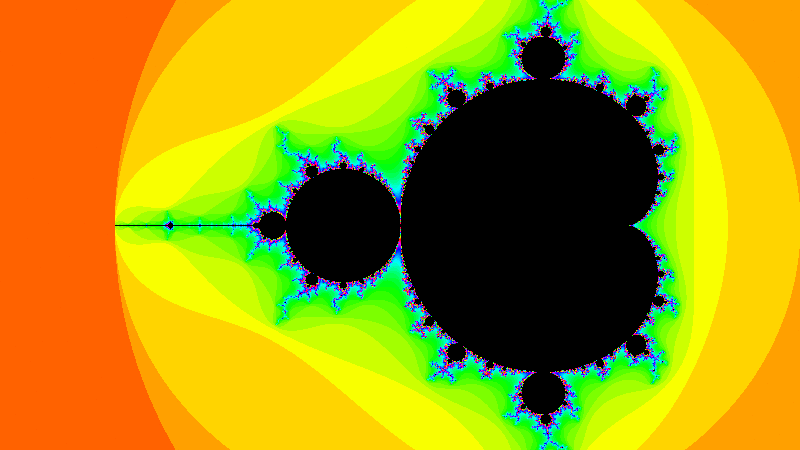

# Mandelbrot

A cpu-bound multi-threaded renderer for the Mandelbrot set written in C++17. Serves no purpose besides looking cool. For an explanation of the Mandelbrot set, have a look at https://en.wikipedia.org/wiki/Mandelbrot_set.

Below you see an example image rendered in 1920x1080 (left) and a low-quality zoom animation rendered in 800x450 (right). For higher quality examples, have a look in /examples.

  
  

# Dependencies

Requires SFML library. On Ubuntu, install it via:

    sudo apt install libsfml-dev

For anything else, the installation paths in the Makefile will probably need to be adjusted.

### Optional

For generating a video out of the png frames, one can use ffmpeg. On Ubuntu, install it via:

    sudo apt install ffmpeg

# Run

Compile the binary by running the Makefile:

    make

and then run the executable:

    ./bin/Mandelbrot

For a list of optional terminal arguments:

    ./bin/Mandelbrot -h

### Controls

- Zoom into the location of the mouse cursor by pressing LMB

- Toggle auto zoom by pressing SPACE

- Toggle fullscreen by pressing f

- Sharpen / blur the image by pressing + / - 
